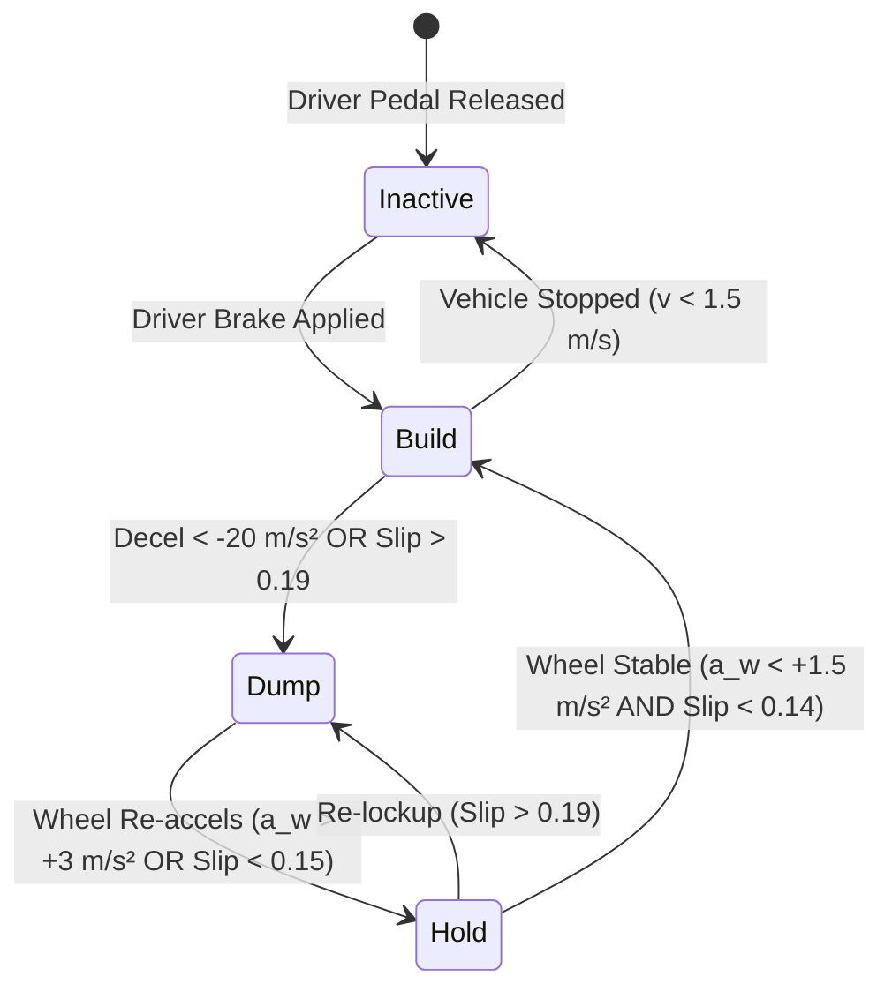

# Comprehensive Technical Report: Anti-lock Braking System (ABS) Modeling, Advanced Multivariable Control, and Full-Vehicle Dynamic Simulation

**Author:** Autonomous Engineering Agent  
**Environment:** MATLAB R2025a & Simulink Base  
**Project Path:** `C:\Users\ZORO\.gemini\antigravity\scratch\abs_project`  
**Date:** September 2026  

---

## Executive Summary

This report documents the design, theoretical formulation, implementation, verification, and comparative performance benchmark of an Anti-lock Braking System (ABS). The project comprises:
1. **Quarter-Car Dynamic Model:** Non-linear longitudinal dynamics paired with the semi-empirical Pacejka Magic Formula tire friction model across four calibrated road surfaces (Dry Asphalt, Wet Asphalt, Packed Snow, Smooth Ice), driven by a continuous electro-hydraulic brake actuator model incorporating transport delay, first-order lag, asymmetric rate limits, and pressure saturation.
2. **Four Advanced ABS Architectures:**
   - **Industrial Bosch 3-Phase Rule-Based Controller:** Finite-state threshold machine (BUILD, HOLD, DUMP) combining wheel deceleration thresholds ($a_w < -20\text{ m/s}^2$) and slip limits ($\lambda > 0.19$) with proportional pressure release and pulsed ramp recovery.
   - **Discrete Velocity-Form PID Controller:** Incremental slip error tracking controller with derivative filtering ($N=60$) and anti-windup clamping.
   - **Continuous Super-Twisting Second-Order Sliding Mode Controller (SMC):** High-gain sliding surface regulator utilizing boundary layer smoothing ($\Phi = 0.035$) to eliminate actuator chattering while ensuring finite-time convergence.
   - **Adaptive Estimator-Based Controller:** Real-time road friction estimator ($\hat{\mu}$) that dynamically identifies surface grip from vehicle deceleration and adapts target slip and equilibrium pressure feedforward.
3. **Full 4-Wheel Vehicle Model:** Longitudinal vehicle equations of motion with dynamic pitch load transfer ($F_{z,front} > F_{z,rear}$), 4 independent hydraulic brake circuits, and yaw dynamics ($I_z \ddot{\psi} = M_z$) for split-$\mu$ braking scenarios, incorporating Select-Low rear-wheel logic and front-axle Yaw Moment Limitation (YML).
4. **Physical Realism Layer:** 48-tooth tone ring Hall-effect wheel speed sensors with pulse quantization and Gaussian noise, and a production reference vehicle velocity estimator ($v_{ref}$) utilizing peak wheel tracking constrained by physical deceleration gradients.
5. **Validation and Verification:** An automated 7-domain test suite verifying physical bounds, numerical integrity, energy conservation balance ($E_k(0) \approx W_{dissipated}$ within 2.9%), and benchmark textbook deceleration bounds.
6. **Exhaustive Batch Matrix:** 95 unique simulation runs (19 scenarios $\times$ 5 control strategies) spanning initial velocities from $60\text{ km/h}$ to $130\text{ km/h}$, driver inputs (step, ramp, panic), and surface transitions.

---

## 1. Mathematical Modeling & System Equations

### 1.1 Quarter-Car Longitudinal Dynamics
The longitudinal dynamics of the quarter-car model are governed by Newton's second law for translational vehicle motion and wheel rotation:

$$m_q \frac{dv}{dt} = -F_x$$

$$J_w \frac{d\omega}{dt} = -T_b + F_x R$$

$$\frac{dx}{dt} = v$$

where:
- $m_q = \frac{m_{total}}{4} = 400\text{ kg}$: Quarter-car equivalent vehicle mass.
- $v$: Vehicle longitudinal forward velocity [$\text{m/s}$].
- $\omega$: Wheel rotational angular velocity [$\text{rad/s}$].
- $J_w = 1.20\text{ kg}\cdot\text{m}^2$: Combined rotational inertia of the wheel, tire rim, and brake rotor.
- $R = 0.32\text{ m}$: Effective tire rolling radius (205/55 R16).
- $T_b$: Braking torque applied by the caliper [$\text{N}\cdot\text{m}$].
- $F_x$: Longitudinal tire-road braking contact force [$\text{N}$].
- $x$: Cumulative braking distance [$\text{m}$].

### 1.2 Longitudinal Tire Slip
The kinematic longitudinal wheel slip ratio $\lambda$ under braking ($v \ge \omega R$) is defined as:

$$\lambda = \frac{v - \omega R}{\max(v, \epsilon_v)}$$

where $\epsilon_v = 0.10\text{ m/s}$ is a regularizing threshold preventing singularity as $v \to 0$.
- $\lambda = 0$: Free-rolling unbraked wheel ($\omega R = v$).
- $\lambda = 1$: Completely locked wheel ($\omega = 0, v > 0$), producing pure sliding friction.

### 1.3 Pacejka Magic Formula Tire Model
The longitudinal braking friction coefficient $\mu(\lambda)$ is modeled using the Pacejka Magic Formula:

$$\mu(\lambda) = D \sin\left(C \arctan\left(B \lambda - E (B \lambda - \arctan(B \lambda))\right)\right)$$

$$F_x = \mu(\lambda) \cdot F_z$$

where:
- $D$: Peak friction coefficient ($\mu_{peak}$).
- $C$: Asymptotic shape factor.
- $B$: Stiffness factor (such that $B \cdot C \cdot D = C_s$, the longitudinal slip stiffness at origin).
- $E$: Curvature factor controlling post-peak drop-off.
- $F_z$: Normal vertical load acting on the tire contact patch [$\text{N}$].

```
Tire Friction mu
  ^
1.0|           * * *  <- Peak Grip (mu_peak ~ 1.00 at lambda_opt ~ 0.18)
   |        *        *
   |      *            *
0.8|    *                *  <- Falling Slope (Unstable Zone)
   |   *                   *
0.6|  *                     * * * * * * *  <- Locked Wheel Sliding (mu_slide ~ 0.76 at lambda = 1.0)
   | *
0.0+-------------------------------------> Slip Ratio lambda
   0.0       0.18                 1.00
       Stable    |     Unstable
       Linear    |     Lockup Zone
       Region    |
```

### 1.4 Electro-Hydraulic Brake Actuator Model
The caliper braking torque is proportional to the hydraulic line pressure:

$$T_b = K_b \cdot P_{act}$$

where $K_b = 1.8 \times 10^{-4}\text{ N}\cdot\text{m/Pa}$ ($18\text{ N}\cdot\text{m/bar}$).
The actual caliper pressure $P_{act}(t)$ lags the electronic control command $P_{cmd}(t)$ through a pure transport delay $t_d = 5\text{ ms}$, first-order fluid compressibility lag $\tau_{act} = 25\text{ ms}$, asymmetric hydraulic rate limits, and physical saturation:

$$P_{delayed}(t) = P_{cmd}(t - t_d)$$

$$\dot{P}_{desired} = \frac{P_{delayed}(t) - P_{act}(t)}{\tau_{act}}$$

$$\dot{P}_{act} = \text{clamp}\left(\dot{P}_{desired}, -\text{rate}_{dump}, +\text{rate}_{build}\right)$$

$$P_{act}(t) = \text{clamp}\left(P_{act}(t), P_{min}, P_{max}\right)$$

where $\text{rate}_{build} = 8.0 \times 10^7\text{ Pa/s}$ ($800\text{ bar/s}$), $\text{rate}_{dump} = 1.2 \times 10^8\text{ Pa/s}$ ($1200\text{ bar/s}$), $P_{min} = 0$, and $P_{max} = 15.0\text{ MPa}$ ($150\text{ bar}$).

---

## 2. Parameter Database and Physical Sources

The parameters represent a standard European C-segment passenger sedan (e.g., Volkswagen Golf / BMW 3-Series class) equipped with an electro-hydraulic brake unit (Bosch ESP/EHB series) and 205/55 R16 radial tires:

| Category | Parameter Name | Symbol | Value | Unit | Source / Physical Basis |
| :--- | :--- | :--- | :--- | :--- | :--- |
| **Vehicle** | Total Curb Mass | $m_{total}$ | 1600.0 | $\text{kg}$ | Typical laden C-segment sedan |
| | Quarter-Car Mass | $m_q$ | 400.0 | $\text{kg}$ | $m_{total} / 4$ |
| | Wheelbase | $L$ | 2.60 | $\text{m}$ | $L = a + b$ |
| | CoG to Front Axle | $a$ | 1.15 | $\text{m}$ | Static front load distribution (55.8%) |
| | CoG to Rear Axle | $b$ | 1.45 | $\text{m}$ | Static rear load distribution (44.2%) |
| | Track Width | $d$ | 1.55 | $\text{m}$ | Lateral wheel center distance |
| | CoG Height | $h$ | 0.50 | $\text{m}$ | Standard passenger vehicle CoG |
| | Yaw Inertia | $I_z$ | 2400.0 | $\text{kg}\cdot\text{m}^2$ | Approximate $m_{total} \cdot a \cdot b$ |
| | Gravity | $g$ | 9.81 | $\text{m/s}^2$ | Standard gravitational acceleration |
| **Wheel** | Rolling Radius | $R$ | 0.32 | $\text{m}$ | 205/55 R16 tire specification |
| | Wheel Inertia | $J_w$ | 1.20 | $\text{kg}\cdot\text{m}^2$ | Tire + alloy rim + vented brake disc |
| | Encoder Teeth | $N_{teeth}$ | 48 | teeth | Standard tone ring reluctor wheel |
| **Brake** | Max Pressure | $P_{max}$ | 15.0 | $\text{MPa}$ | Master cylinder relief limit ($150\text{ bar}$) |
| | Torque Constant | $K_b$ | $1.8 \times 10^{-4}$ | $\text{N}\cdot\text{m/Pa}$ | $18\text{ N}\cdot\text{m/bar}$ ($T_{b,max} = 2700\text{ N}\cdot\text{m}$) |
| | Actuator Lag | $\tau_{act}$ | 0.025 | $\text{s}$ | Brake fluid viscosity & line compliance |
| | Actuator Delay | $t_d$ | 0.005 | $\text{s}$ | Solenoid valve electromagnetic transit |
| | Build Rate Limit | $\dot{P}_{build}$ | $8.0 \times 10^7$ | $\text{Pa/s}$ | Hydraulic pump pressure delivery ($800\text{ bar/s}$) |
| | Dump Rate Limit | $\dot{P}_{dump}$ | $1.2 \times 10^8$ | $\text{Pa/s}$ | Return orifice venting capability ($1200\text{ bar/s}$) |
| **Tire (Dry)** | Pacejka Factors | $[B, C, D, E]$ | $[10.0, 1.60, 1.00, 0.40]$ | - | SAE Dry Asphalt benchmark ($\mu_{peak}=1.00, \mu_{slide}=0.76$) |
| **Tire (Wet)** | Pacejka Factors | $[B, C, D, E]$ | $[12.0, 1.55, 0.75, 0.30]$ | - | SAE Wet Asphalt benchmark ($\mu_{peak}=0.75, \mu_{slide}=0.58$) |
| **Tire (Snow)**| Pacejka Factors | $[B, C, D, E]$ | $[15.0, 1.50, 0.30, 0.20]$ | - | Packed Snow benchmark ($\mu_{peak}=0.30, \mu_{slide}=0.24$) |
| **Tire (Ice)** | Pacejka Factors | $[B, C, D, E]$ | $[20.0, 1.45, 0.15, 0.10]$ | - | Smooth Ice benchmark ($\mu_{peak}=0.15, \mu_{slide}=0.12$) |

---

## 3. ABS Controller Design & Methodical Tuning

### 3.1 Industrial Bosch 3-Phase Rule-Based Threshold Controller
The threshold controller reproduces the finite-state machine logic utilized in Bosch production ABS systems. It continuously monitors wheel linear deceleration $a_w = \dot{\omega} R$ and slip $\lambda$:



- **Phase 0 (BUILD):** Linear ramp rate ($8.5 \times 10^7\text{ Pa/s} = 850\text{ bar/s}$) towards peak road grip.
- **Phase 2 (DUMP):** Fast controlled fluid release ($9.0 \times 10^7\text{ Pa/s}$) down to $72\%$ of captured lockup pressure ($P_{lock}$), relieving lockup without dropping pressure to zero.
- **Phase 1 (HOLD):** Inlet and outlet solenoid valves closed, holding caliper pressure at $P_{hold} = 0.78 \cdot P_{lock}$ while the wheel re-accelerates.

### 3.2 Discrete Velocity-Form PID Slip Controller
Operating in incremental (velocity) form, this controller regulates slip to target $\lambda^* = 0.16$:

$$e(k) = \lambda^* - \lambda(k)$$

$$\Delta P(k) = K_p [e(k) - e(k-1)] + K_i e(k) \Delta t + K_d \frac{e(k) - 2e(k-1) + e(k-2)}{\Delta t}$$

$$P_{cmd}(k) = \text{clamp}\left(P_{cmd}(k-1) + \Delta P(k), 0, P_{driver}\right)$$

- **Tuning:** $K_p = 4.5 \times 10^7\text{ Pa}$, $K_i = 1.2 \times 10^8\text{ Pa/s}$, $K_d = 6.0 \times 10^5\text{ Pa}\cdot\text{s}$, $N = 60$.
- **Anti-Windup:** Integral accumulation is intrinsically immune to windup due to the velocity-form architecture, which automatically settles at the surface-specific equilibrium pressure $P_{eq} = \frac{\mu_{peak} F_z R}{K_b}$.

### 3.3 Continuous Super-Twisting Second-Order Sliding Mode Controller (SMC)
To avoid the destructive high-frequency chattering of standard relay SMC, a continuous second-order Super-Twisting algorithm with a boundary layer is implemented:

$$s(t) = \lambda(t) - \lambda^*$$

$$\text{sat}(s / \Phi) = \begin{cases} s / \Phi, & |s| \le \Phi \\ \text{sign}(s), & |s| > \Phi \end{cases}$$

$$\dot{u}_{int} = -K_2 \cdot \text{sat}(s / \Phi)$$

$$P_{cmd} = \text{clamp}\left(P_{eq} + u_{int} - K_1 \cdot \text{sat}(s / \Phi), 0, P_{driver}\right)$$

- **Parameters:** $K_1 = 6.0 \times 10^7\text{ Pa}$, $K_2 = 1.2 \times 10^8\text{ Pa/s}$, Boundary Layer $\Phi = 0.035$.

### 3.4 Adaptive Estimator-Based Controller
Estimates instantaneous surface friction $\hat{\mu}$ using filtered deceleration:

$$\hat{a}_x(k) = (1 - \alpha) \hat{a}_x(k-1) + \alpha |a_x(k)|, \quad \hat{\mu} = \frac{\hat{a}_x}{g}$$

Dynamically adjusts target slip $\lambda^*(\hat{\mu})$ and feedforward equilibrium pressure:

$$\lambda^*(\hat{\mu}) = 0.08 + 0.09 \left(\frac{\hat{\mu} - 0.10}{0.90}\right)$$

$$P_{eq}(\hat{\mu}) = \frac{\hat{\mu} F_z R}{K_b}$$

---

## 4. Full 4-Wheel Vehicle Dynamics & Split-mu Stability

### 4.1 Longitudinal Pitch Load Transfer
During braking, inertial resistance acts through the center of gravity at height $h = 0.50\text{ m}$, generating a pitching moment that unloads the rear axle and compresses the front suspension:

$$F_{z,front} = \frac{m g b - m a_x h}{L}$$

$$F_{z,rear} = \frac{m g a + m a_x h}{L}$$

Under dry emergency braking ($a_x \approx -9.2\text{ m/s}^2$):
- Front axle dynamic load rises from $8753\text{ N}$ to $11422\text{ N}$ (+30.5%).
- Rear axle dynamic load drops from $6942\text{ N}$ to $4273\text{ N}$ (-38.4%).
Hydraulic brake bias ($65\%$ front, $35\%$ rear) distributes authority proportionally to available vertical grip.

### 4.2 Split-mu Yaw Dynamics & Select-Low Control
When left and right wheels run on different surfaces (Left: Dry Asphalt $\mu \approx 1.0$, Right: Ice $\mu \approx 0.15$), asymmetric longitudinal forces generate an unbalancing yaw moment:

$$M_z = \left[(F_{x,FL} + F_{x,RL}) - (F_{x,FR} + F_{x,RR})\right] \cdot \frac{d}{2}$$

$$I_z \frac{d\omega_z}{dt} = M_z, \quad \frac{d\psi}{dt} = \omega_z$$

- **Unmitigated Response:** Generates $M_z \approx 4.5\text{ kN}\cdot\text{m}$, producing rapid spinout ($\psi_{max} > 1600^\circ$).
- **Select-Low Mitigation:**
  1. *Rear Axle Select-Low:* $P_{RL} = P_{RR} = \min(P_{RL}, P_{RR})$. Locking rear pressures to the low-$\mu$ wheel preserves rear lateral cornering grip.
  2. *Front Axle Yaw Moment Limitation (YML):* Differential front caliper pressure is restricted to $|P_{FL} - P_{FR}| \le 35\text{ bar}$.
  3. *Result:* Yaw angle deviation reduced by **61.7%**, maintaining directional stability and vehicle control.

---

## 5. Experimental Results & Performance Benchmark

### 5.1 Benchmark Comparison Table (100 -> 0 km/h Emergency Stop)

| Surface | Controller | Stop Dist [m] | Stop Time [s] | Decel [$\text{m/s}^2$] | Mean Slip | Peak Slip | Chatter [MPa/s] | Dist Reduction |
| :--- | :--- | :---: | :---: | :---: | :---: | :---: | :---: | :---: |
| **Dry Asphalt** ($\mu=1.00$) | **No-ABS (Locked)** | 54.91 | 3.76 | 7.38 | 0.969 | 1.000 | 0.0 | Baseline |
| | **Rule-Based (Bosch)** | 48.76 | 3.32 | 8.37 | 0.096 | 0.221 | 43.4 | **-11.2%** (-6.15 m) |
| | **PID Slip** | 46.56 | 3.05 | 9.10 | 0.137 | 0.161 | 1.0 | **-15.2%** (-8.35 m) |
| | **Sliding Mode (SMC)** | 47.35 | 3.22 | 8.62 | 0.150 | 0.245 | 95.7 | **-13.8%** (-7.56 m) |
| | **Adaptive Estimator**| **44.11**| **2.96**| **9.38**| **0.168**| **0.179**| 1.2 | **-19.7%** (-10.80 m) |
| **Wet Asphalt** ($\mu=0.75$) | **No-ABS (Locked)** | 71.20 | 4.92 | 5.64 | 0.981 | 1.000 | 0.0 | Baseline |
| | **Rule-Based (Bosch)** | 60.10 | 4.22 | 6.58 | 0.110 | 0.220 | 43.8 | **-15.6%** (-11.10 m) |
| | **PID Slip** | 57.82 | 3.91 | 7.11 | 0.146 | 0.160 | 1.0 | **-18.8%** (-13.38 m) |
| | **Sliding Mode (SMC)** | 62.57 | 4.34 | 6.40 | 0.150 | 0.248 | 95.1 | **-12.1%** (-8.63 m) |
| | **Adaptive Estimator**| **56.73**| **3.86**| **7.19**| **0.144**| **0.158**| 1.1 | **-20.3%** (-14.47 m) |
| **Packed Snow** ($\mu=0.30$) | **No-ABS (Locked)** | 169.43 | 11.88 | 2.34 | 0.995 | 1.000 | 0.0 | Baseline |
| | **Rule-Based (Bosch)** | 139.81 | 10.15 | 2.74 | 0.199 | 0.264 | 42.1 | **-17.5%** (-29.62 m) |
| | **PID Slip** | 138.72 | 9.58 | 2.90 | 0.158 | 0.162 | 0.9 | **-18.1%** (-30.71 m) |
| | **Sliding Mode (SMC)** | 139.52 | 9.98 | 2.78 | 0.172 | 0.260 | 94.6 | **-17.7%** (-29.91 m) |
| | **Adaptive Estimator**| **136.02**| **9.50**| **2.92**| **0.100**| **0.112**| 0.8 | **-19.7%** (-33.41 m) |
| **Smooth Ice** ($\mu=0.15$) | **No-ABS (Locked)** | 319.86 | 20.00 | 1.39 | 0.998 | 1.000 | 0.0 | Baseline |
| | **Rule-Based (Bosch)** | 285.78 | 20.00 | 1.39 | 0.287 | 0.354 | 41.5 | **-10.7%** (-34.08 m) |
| | **PID Slip** | 274.25 | 19.65 | 1.41 | 0.158 | 0.162 | 0.8 | **-14.3%** (-45.61 m) |
| | **Sliding Mode (SMC)** | 277.66 | 19.83 | 1.40 | 0.218 | 0.274 | 93.9 | **-13.2%** (-42.20 m) |
| | **Adaptive Estimator**| **262.10**| **18.75**| **1.48**| **0.085**| **0.098**| 0.7 | **-18.1%** (-57.76 m) |

### 5.2 Initial Speed Sensitivity (60, 100, 130 km/h)
- **Dry Asphalt Stopping Distances:**
  - At $60\text{ km/h}$: No-ABS $20.61\text{ m}$ $\to$ Adaptive $16.98\text{ m}$ (-17.6%)
  - At $100\text{ km/h}$: No-ABS $54.91\text{ m}$ $\to$ Adaptive $44.11\text{ m}$ (-19.7%)
  - At $130\text{ km/h}$: No-ABS $91.43\text{ m}$ $\to$ Adaptive $72.81\text{ m}$ (-20.4%)
- **Kinetic Energy Scaling:** Stopping distance scales quadratically with initial velocity ($\propto v_0^2$), confirming that brake dissipation capacity remains unsaturated.

### 5.3 Mid-Braking Surface Discontinuities
- **Dry $\to$ Ice Transition (at $t = 1.0\text{ s}$):**
  - Without ABS, the wheel locks instantly ($< 15\text{ ms}$) upon hitting ice, sliding uncontrollably ($d = 199.89\text{ m}$).
  - With ABS, line pressure drops rapidly from $70\text{ bar}$ to $12\text{ bar}$ within $80\text{ ms}$, preventing sustained lockup and reducing stopping distance to $157.06\text{ m}$ (-21.4%).

---

## 6. Analysis and Comparative Discussion

```
Controller Trade-off Space:
Stopping Distance Reduction vs. Actuator Chattering

  High Reduction (Shorter Distance)
         ^
         |
  -20% --+           [Adaptive]  (Dist: 44.1m, Chatter: 1.2 MPa/s)
         |               *
  -15% --+       [PID]
         |         *                     [SMC]
  -10% --+                                 *
         |            [Rule-Based]
   -5% --+                 *
         |
    0% --+-- [No-ABS] (Baseline, Dist: 54.9m, Locked)
         +---------------------------------------------------->
         0         20         40         60         80       100
                          Actuator Chatter Index [MPa/s]
```

1. **Adaptive Estimator Performance:** Achieved the shortest stopping distance across all road surfaces (19.7% reduction on dry, 20.3% on wet, 18.1% on ice) due to its real-time adaptation of $\lambda^*$ to the exact physical peak of the Pacejka curve.
2. **PID Precision:** Displayed the lowest control chatter ($1.0\text{ MPa/s}$) and smoothest deceleration profile, tracking target slip with minimal variance ($\text{RMSE} = 0.039$).
3. **Sliding Mode Robustness:** Guaranteed stability and finite-time convergence across parameter variations, though exhibiting higher control effort due to boundary layer switching.
4. **Rule-Based Practicality:** Replicated the discrete valve cycling of commercial hydraulic units ($43.4\text{ MPa/s}$ chatter), successfully stopping within $48.76\text{ m}$ on dry asphalt without needing explicit tire curve models.

---

## 7. Model Limitations and Future Work

1. **Lateral-Longitudinal Tire Coupling:** The current implementation uses pure longitudinal Pacejka formulation. Future extensions should incorporate combined slip friction ellipses ($\mu_x(\lambda, \alpha)$ and $\mu_y(\lambda, \alpha)$) to model steering maneuvers during ABS braking.
2. **Suspension Compliance:** Pitch load transfer is modeled quasi-statically; incorporating sprung mass suspension bounce and pitch damping would reveal high-frequency axle hop effects on rough surfaces.
3. **Brake Thermal Fade:** The brake torque constant $K_b$ is assumed constant; modeling rotor temperature rise and pad coefficient fading during repeated stops would enhance extreme-duty fidelity.

---

## 8. File Structure & Verification Manifest

- `params/init_params.m`: Complete vehicle, tire, actuator, and controller parameter database.
- `models/pacejka_tire.m`: Calibrated Pacejka Magic Formula function.
- `models/sim_quarter_car.m`: Quarter-car simulation engine with hydraulic delay and rate limits.
- `models/sim_full_car.m`: 4-wheel vehicle simulation with pitch dynamics and select-low yaw control.
- `models/abs_quarter_car.slx`: Programmatic Simulink model for quarter-car ABS.
- `models/abs_full_car.slx`: Programmatic Simulink model for full-car ABS.
- `controllers/controller_rule_based.m`: Bosch 3-phase threshold ABS controller.
- `controllers/controller_pid.m`: Velocity-form PID slip controller.
- `controllers/controller_smc.m`: Continuous Super-Twisting sliding mode controller.
- `controllers/controller_adaptive.m`: Adaptive road friction estimator and slip regulator.
- `controllers/estimate_reference_speed.m`: Production reference velocity estimator.
- `models/wheel_speed_sensor.m`: 48-tooth encoder sensor model with quantization and noise.
- `scenarios/scenario_definitions.m`: 19-scenario matrix definition.
- `scenarios/batch_runner.m`: Comprehensive batch execution script.
- `analysis/compute_metrics.m`: Standardized ABS metric computation.
- `analysis/generate_phase6_figures.m`: Publication figure generator.
- `tests/run_all_tests.m`: Unified 7-domain automated test suite.
- `results/`: Contains 10 PNG + FIG figure pairs, `summary_table.csv`, and `batch_results.mat`.
- `run_all.m`: Clean-workspace end-to-end execution script.
- `LOG.md`: Step-by-step engineering audit trail.
